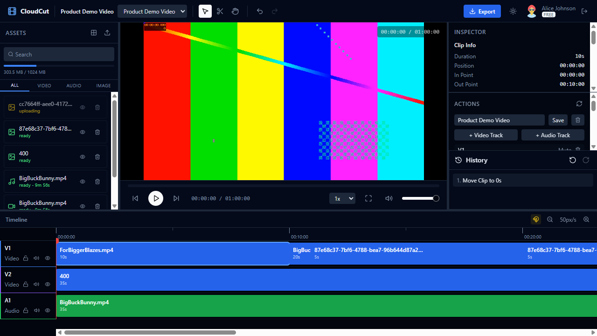
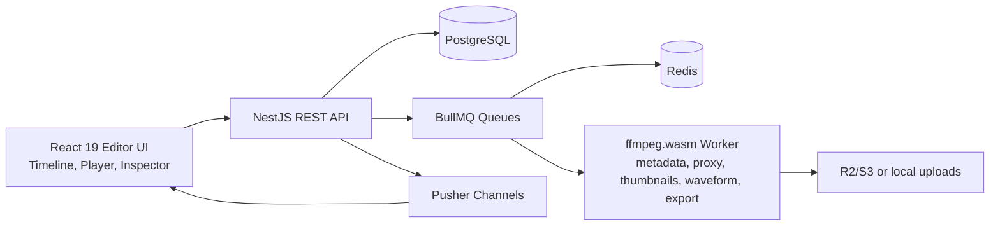

# CloudCut - Collaborative Video Editing SaaS

CloudCut is a browser-based collaborative video editor prototype inspired by CapCut and Canva Video. It includes database design, NestJS APIs, BullMQ video-processing jobs, Pusher collaboration, and a React editor UI.



## Tech Stack

| Layer | Technology |
|---|---|
| Frontend | React 19, TypeScript strict mode, Vite, Tailwind CSS, shadcn-style Radix UI components, Zustand |
| Backend | NestJS, TypeScript strict mode, Prisma ORM, class-validator, Swagger |
| Database | PostgreSQL |
| Queue | BullMQ + Redis |
| Video Processing | `@ffmpeg/ffmpeg` / ffmpeg.wasm first, with `ffmpeg-static` native fallback for local reliability |
| Real-time | Pusher Channels |
| Auth | JWT access token + refresh token |

## Architecture



## Quick Start

### Prerequisites

- Docker

### Option 1: Docker Compose

```bash
docker compose up
```

Docker Compose builds the frontend/backend images, starts PostgreSQL and Redis, runs Prisma migrations automatically, and seeds demo data the first time the database is empty.

Frontend: `http://localhost:5173`
Backend Swagger: `http://localhost:3000/api/docs`

Demo accounts:

```text
alice@cloudcut.dev / password123
bob@cloudcut.dev / password123
```

### Option 2: Manual Local Setup

Backend:

```bash
cd backend
npm install
cp .env.example .env
npx prisma migrate dev
npx prisma db seed
npm run start:dev
```

Frontend:

```bash
cd frontend
npm install
cp .env.example .env
npm run dev
```

## Environment Files

Backend variables are documented in `backend/.env.example`.

Frontend variables are documented in `frontend/.env.example`.

Pusher is optional for local single-user editing. Without Pusher credentials, the editor still loads and core editing features work; real-time presence and broadcast sync need valid `PUSHER_*` and `VITE_PUSHER_*` values.

## Project Structure

```text
cloudcut/
  README.md
  docker-compose.yml
  backend/
    prisma/
      schema.prisma
      migrations/
      seed.ts
    src/
      auth/
      users/
      workspaces/
      projects/
      assets/
      timeline/
      exports/
      collaboration/
      jobs/
      common/
    DESIGN.md
  frontend/
    src/
      components/
      hooks/
      services/
      state/
      types/
      utils/
    DESIGN.md
  docs/
    architecture.md
    api-spec.md
    database-design.md
    screenshots/
      editor.png
```

## Implemented Challenge Coverage

### Task 1: Database

- Prisma schema with users, workspaces, projects, assets, timeline, exports, and operation logs.
- Migration files and seed data.
- Indexes for membership lookup, project lists, media filters, timeline rendering, export cleanup, and collaboration replay.
- Soft-delete and cleanup strategy.
- Storage estimate and OperationLog archive/partition strategy.

### Task 2: NestJS API

- JWT auth: register, login, refresh, current user.
- Workspace/project/asset/timeline/export/collaboration endpoints.
- `class-validator` DTOs, global validation pipe, consistent error filter.
- Role-based authorization through workspace membership.
- Cursor pagination for list endpoints.
- Swagger UI at `/api/docs`.

### Task 3: Queue and Video Processing

- BullMQ queue registration and processors.
- Asset pipeline: metadata, proxy, thumbnails, waveform, ready status.
- Export pipeline: timeline validation, trim/concat, multi-track overlay path, effects/text overlay hooks, output URL update.
- Retry/backoff, dead-letter queue, progress updates, cancel support, cleanup job, idempotency keys.
- ffmpeg.wasm is attempted first; native ffmpeg fallback keeps local demos dependable.

### Task 4: Collaboration

- Pusher private and presence channel auth.
- Presence list and remote timeline cursors.
- Timeline operation broadcast with `OperationLog`.
- Typed events such as `clip-updated`, `track-updated`, and `effect-updated`.
- Offline reconnect replay using per-project sequence numbers.
- Last-write-wins conflict handling with server authority.

### Task 5: Editor UI

- React 19 editor layout using resizable panels.
- Timeline tracks, clips, drag, trim, split, select, delete, copy/paste, zoom, scroll, snap, and draggable playhead.
- Video player with play/pause, seek, volume, mute, speed, fullscreen, and CSS filter preview.
- Inspector with clip info, transform controls, and effects editor.
- Asset browser with upload flow, filters, status badges, preview/delete, and drag-to-timeline.
- Project/action panel exposes the remaining REST workflows: create workspace, create/duplicate/delete project, snapshots, batch clip operations, transition updates, export detail/cancel, collaboration presence/operation stats, workspace invites, member role changes, and member removal.
- Zustand stores and command-pattern undo/redo history.

## Tests and Verification

Backend:

```bash
cd backend
npm run build
npm test -- --runInBand
```

Frontend:

```bash
cd frontend
npm run build
npm test -- --run
```

Current local verification:

- Backend build passes.
- Frontend build passes.
- Backend Jest suites pass.
- Frontend Vitest suites pass.
- Editor UI loads in the browser at `http://localhost:5173`.

## Documentation

- [Architecture Overview](docs/architecture.md)
- [API Specification](docs/api-spec.md)
- [Database Design](docs/database-design.md)
- [Backend Design Decisions](backend/DESIGN.md)
- [Frontend Design Decisions](frontend/DESIGN.md)
