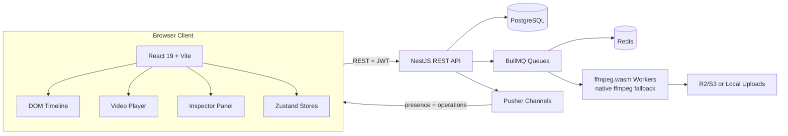

# CloudCut Architecture

CloudCut เป็น browser-based collaborative video editing SaaS prototype โครงสร้างหลักแบ่งเป็น React client, NestJS API, PostgreSQL, Redis/BullMQ workers, storage และ Pusher Channels

## Component Diagram

## Backend Modules

| Module | Responsibility |
|---|---|
| `auth` | register, login, refresh token, JWT guard |
| `users` | current user data |
| `workspaces` | workspace CRUD, members, invitations, roles |
| `projects` | project CRUD, duplicate, snapshots |
| `assets` | presigned upload, confirm upload, asset listing, soft delete |
| `timeline` | tracks, clips, split, batch ops, effects, transitions, text overlays |
| `exports` | export job creation, status, cancellation |
| `collaboration` | Pusher auth, operation log replay, presence |
| `jobs` | BullMQ queues, ffmpeg processing, cleanup, progress |

## Data Flow

### Upload Flow

1. Client requests `POST /assets/presigned-url`
2. API creates `Asset` with status `uploading`
3. Client uploads directly to R2/S3 or local fallback endpoint
4. Client calls `POST /assets/confirm-upload`
5. API marks video/audio as `processing`
6. BullMQ runs metadata, proxy, thumbnail and waveform jobs
7. Asset becomes `ready`
8. Pusher notifies the user channel

### Collaboration Flow

1. User edits timeline locally with optimistic update
2. Client sends mutation to REST API
3. API validates authorization and saves to PostgreSQL
4. API writes `OperationLog`
5. API broadcasts generic and typed Pusher events
6. Other clients apply the operation to Zustand state
7. On reconnect, clients replay missed operations using `sinceSeq`

### Export Flow

1. Client creates export with idempotency key
2. API creates `ExportJob` status `queued`
3. BullMQ worker validates timeline and ready assets
4. Worker trims clips, concatenates segments, optionally overlays tracks/effects/text
5. Worker writes output URL and file size
6. Pusher sends `job-progress` and `export-completed`

## Reliability

- JWT guards protect API resources
- Workspace membership controls authorization
- Cursor pagination avoids offset drift
- BullMQ retry/backoff handles transient job failures
- Dead-letter queue captures permanent failures
- Idempotency keys prevent duplicate upload confirms and duplicate exports
- Cleanup job removes expired exports, old soft-deleted data and orphaned assets

## Scaling Notes

- PostgreSQL remains the source of truth for projects, timeline data and operation logs
- Redis supports queue state and rate/concurrency limits
- Media files live outside PostgreSQL
- Pusher can be replaced by Socket.IO/uWebSockets + Redis/NATS fan-out if realtime traffic outgrows the managed plan
- Long video processing should move to chunked/native workers for production scale
